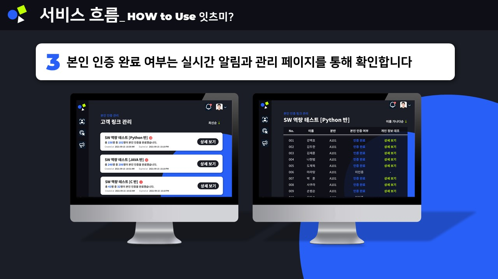
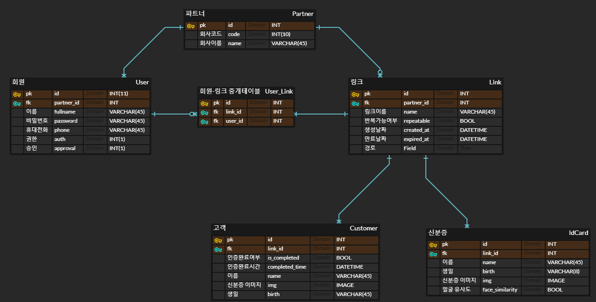
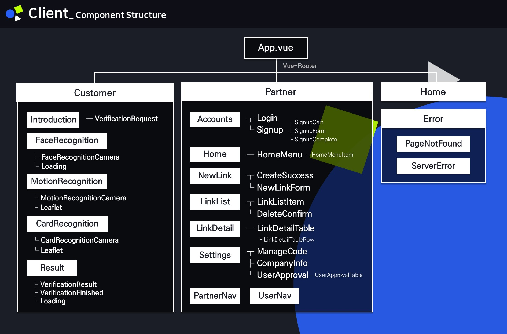
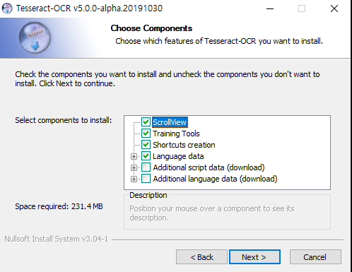
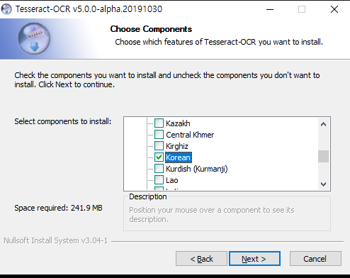

# It's Me!

> 인공지능을 활용한 본인인증 통합 솔루션, 잇츠미입니다.


## 🌟 Overview

[](https://www.youtube.com/watch?v=UK6KyklmZb4)

- **It's ME!**는, 인공지능 모델을 활용한 본인인증 통합 솔루션입니다. 

  비대면 상황에서 본인인증을 필요로 하는 기업을 타겟으로 **B2B 서비스**를 기획했습니다. 비즈니스 파트너사가 본인인증 링크를 생성하고 고객을 관리할 수 있는 **파트너 워크 플랫폼**을 제공합니다. 고객이 사용하는 본인인증 서비스는 `tensorflow.js`의 모델을 활용한 얼굴 인식과 실시간 모션 인식, `OpenCV`와 `Tesseract`를 활용한 신분증 OCR, `dlib` 기반의 이미지 유사도 판별로 진행됩니다.


## 🚀 Service





## Code organization

```bash
 ├── README.md
 ├── client
 │   ├── public
 │   ├── src
 │    	 ├── api
 │       ├── assets
 │           ├── image
 │           └── style
 │       ├── components
 │           ├── customer
 │           └── partner
 │       ├── router
 │       ├── store
 │       └── views
 │           ├── customer
 │           ├── error
 │           ├── intro
 │           └── partner
 │   ├── App.vue
 │   └── main.js
 ├── server
 │   ├── .config				<-- nginx, uwsgi configuration
 │       ├── nginx
 │       └── uwsgi
 │   ├── accounts				<-- accounts app
 │   ├── info					<-- info app
 │   ├── its_me					<-- project
 │   ├── static					<-- static files
 │   ├── manage.py
 │   └── requirements.txt
```


## Design

### Entity Relationship Diagram



### Component Structure




## Install Dependencies & Run server

### client

1. 패키지를 설치합니다.

```
$ npm install
```


2. 서버를 실행합니다.

```
$ npm run serve
```


### server

1. 가상환경을 생성하고 활성화합니다.

```
$ python -m venv [NAME]
```

\[NAME]: 가상환경 이름

```
# activate
$ source [NAME]/Scripts/activate
```

```
# deactivate
$ deactivate
```


2. 필요한 라이브러리를 설치합니다.

```
$ pip install -r requirements.txt
```


3. tesseract를 설치합니다.

##### Windows(10)

아래의 링크에서 자신에게 맞는 윈도우버전의 tesseract 설치합니다.

설치 시에 `Additional language data`에서 `Korean`을 선택합니다.(아래 그림 참고)

설치 링크: https://github.com/UB-Mannheim/tesseract/wiki






##### Linux(Ubuntu)

아래 명령어로 tesseract와 korean language를 설치합니다.

```
sudo apt-get install tesseract-ocr
sudo apt-get install tesseract-ocr-kor
```


4. tesseract 경로를 확인하고 `server/info/utils/ocr.py`에서 104번째 줄의 코드를 수정해줍니다.

```python
1   import pytesseract
.
.
.
104 pytesseract.pytesseract.tesseract_cmd = r'C:/Program Files/Tesseract-OCR/tesseract.exe'		# Windows10 기본 설치 경로
# pytesseract.pytesseract.tesseract_cmd = r'/usr/bin/tesseract'									# Ubuntu 기본 설치 경로
# pytesseract.pytesseract.tesseract_cmd = r'<full_path_to_your_tesseract_executable>'
```


5. 장고 서버를 실행합니다.

```
$ python manage.py runserver
```


