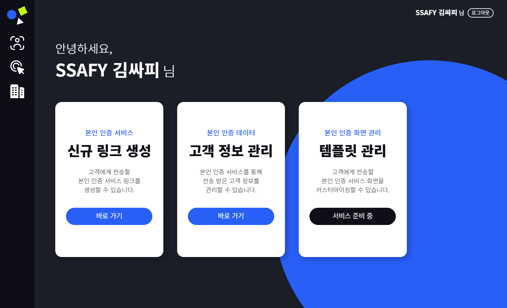
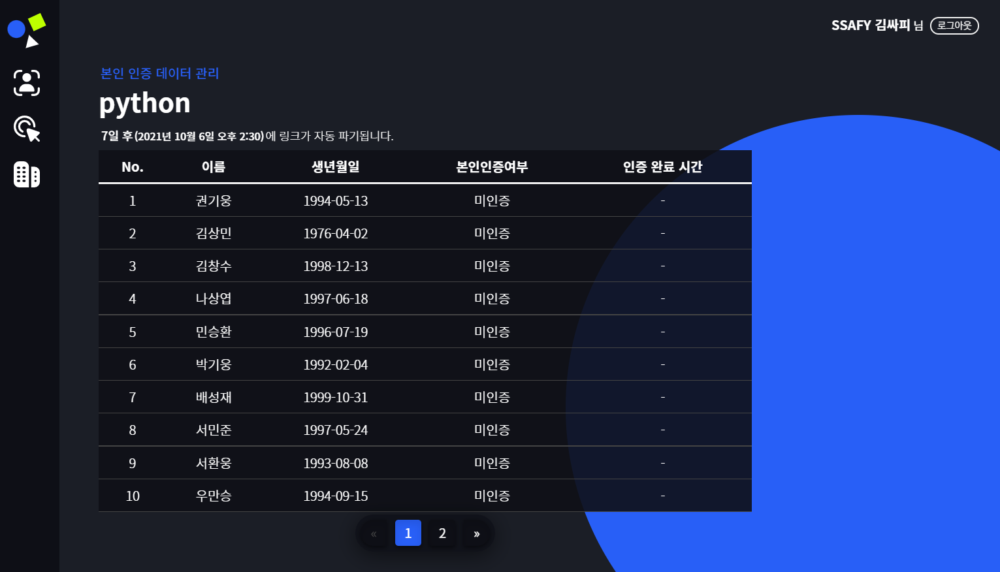

# It's Me!


## Introduction

본인 인증 통합 솔루션, **잇츠미**

잇츠미는 인공지능 기술을 적용해 보다 정확하고 간편한 본인 인증 절차를 제공하는 웹 서비스를 목표로 합니다.

고객의 얼굴과 신분증 사진을 대조하여 **이미지 유사도 평가**를 진행하고, 실시간 **모션 인식**을 통해 본인 확인을 진행합니다.

뿐만 아니라 **신분증 OCR**을 통해 빠르고 편리한 정보 확인은 물론, **비식별화** 기술로 개인 정보를 안전하게 처리할 수 있습니다.

이 모든 과정을 웹 URL 하나로 해결하며, 워크 플랫폼을 통해 간편하게 본인 인증 결과를 확인할 수 있습니다.


## Content

- [Code organization](#code-organization)
- [Install Dependencies & Run server](#install-dependencies-&-run-server)
- [Feature](#feature)
- [Design](#design)


## Code organization

```bash
 ├── README.md
 ├── client
 │   ├── public
 │   ├── src
 │    	 ├── api
 │       ├── assets
 │           ├── image
 │           └── style
 │       ├── components
 │           ├── customer
 │           └── partner
 │       ├── router
 │       ├── store
 │       └── views
 │           ├── customer
 │           ├── error
 │           ├── intro
 │           └── partner
 │   ├── App.vue
 │   └── main.js
 ├── server
 │   ├── .config				<-- nginx, uwsgi configuration
 │	 	 ├── nginx
 │       └── uwsgi
 │   ├── accounts				<-- accounts app
 │   ├── info					<-- info app
 │   ├── its_me					<-- project
 │   ├── static					<-- static files
 │   ├── manage.py
 │   └── requirements.txt
```


## Install Dependencies & Run server

### client

1. 패키지를 설치합니다.

```
$ npm install
```


2. 서버를 실행합니다.

```
$ npm run serve
```


### server

1. 가상환경을 생성하고 활성화합니다.

```
$ python -m venv [NAME]
```

\[NAME]: 가상환경 이름

```
# activate
$ source [NAME]/Scripts/activate
```

```
# deactivate
$ deactivate
```


2. 필요한 라이브러리를 설치합니다.

```
$ pip install -r requirements.txt
```


3. tesseract를 설치합니다.

##### Windows(10)

아래의 링크에서 자신에게 맞는 윈도우버전의 tesseract 설치합니다.

설치 시에 `Additional language data`에서 `Korean`을 선택합니다.(아래 그림 참고)

설치 링크: https://github.com/UB-Mannheim/tesseract/wiki


##### Linux(Ubuntu)

아래 명령어로 tesseract와 korean language를 설치합니다.

```
sudo apt-get install tesseract-ocr
sudo apt-get install tesseract-ocr-kor
```


4. tesseract 경로를 확인하고 `server/info/utils/ocr.py`에서 104번째 줄의 코드를 수정해줍니다.

```python
1   import pytesseract
.
.
.
104 pytesseract.pytesseract.tesseract_cmd = r'C:/Program Files/Tesseract-OCR/tesseract.exe'		# Windows10 기본 설치 경로
# pytesseract.pytesseract.tesseract_cmd = r'/usr/bin/tesseract'									# Ubuntu 기본 설치 경로
# pytesseract.pytesseract.tesseract_cmd = r'<full_path_to_your_tesseract_executable>'
```


5. 장고 서버를 실행합니다.

```
$ python manage.py runserver
```


## Design

### Entity Relationship Diagram


### 🍀 FE 파트 화면 정리

- Partners Home

  


- 신규 링크 생성

  


- 링크 리스트 조회

  

- 링크 상세 정보 조회

  

- 로그인 (위치 조정 필요)

  


- 회원가입 단계별 페이지

  


