# 시연 시나리오

## 1. B2B Home

### 1. 최초 페이지

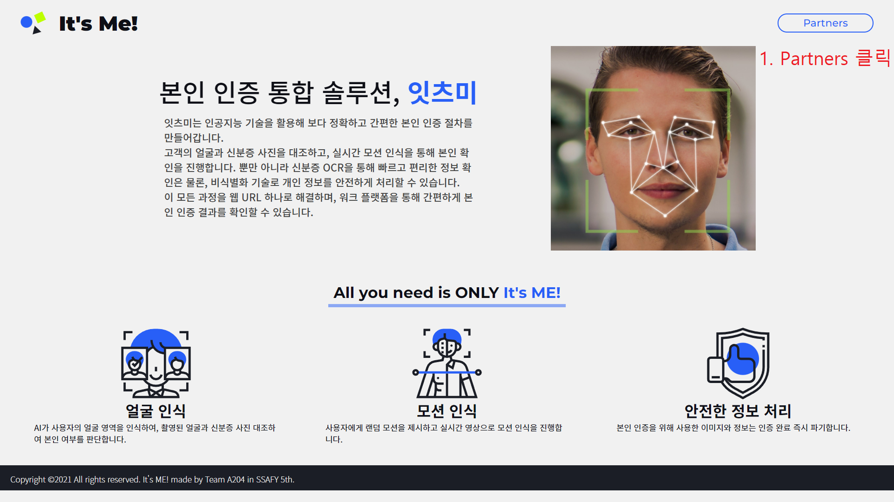

## 2. partners 회원가입

### 1. 회원가입 - 소속회사 확인

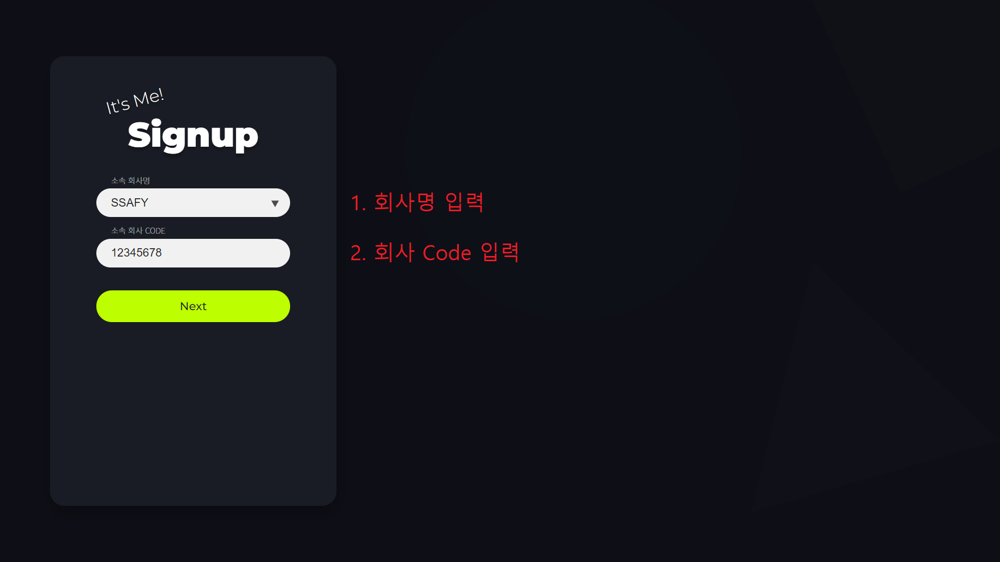

### 2. 회원가입 - 본인정보 입력

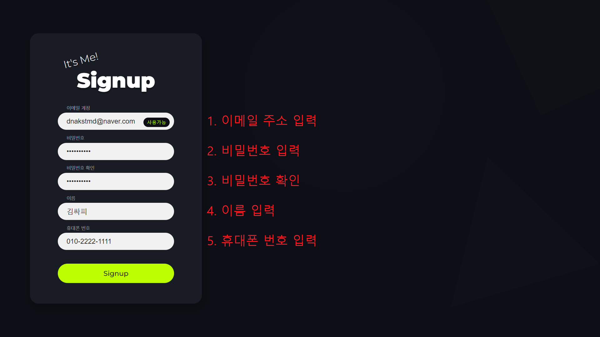

### 3. 회원가입 - 가입대기

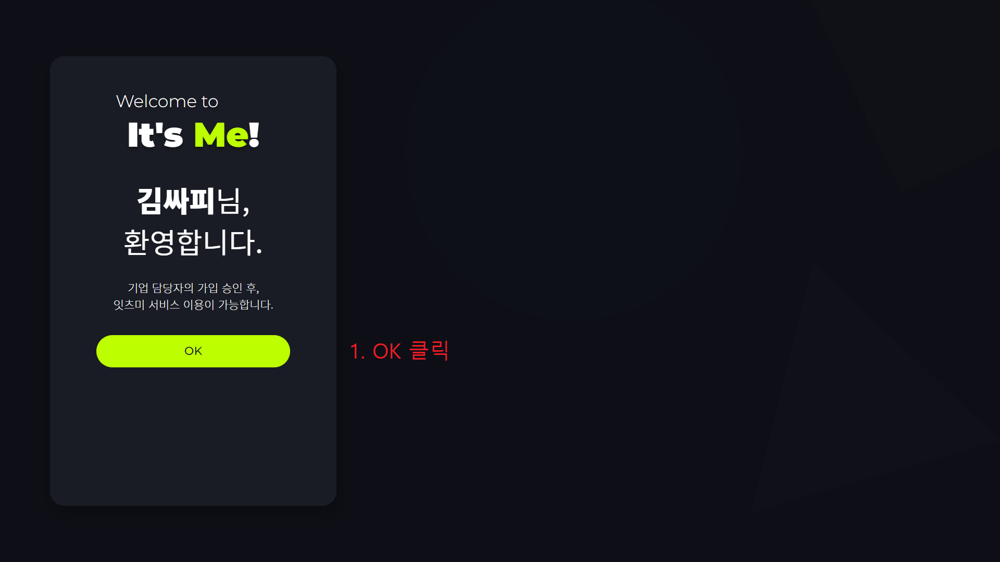

### 4. 회원가입 - 가입승인, 관리자 페이지

.png)

### 5. 로그인

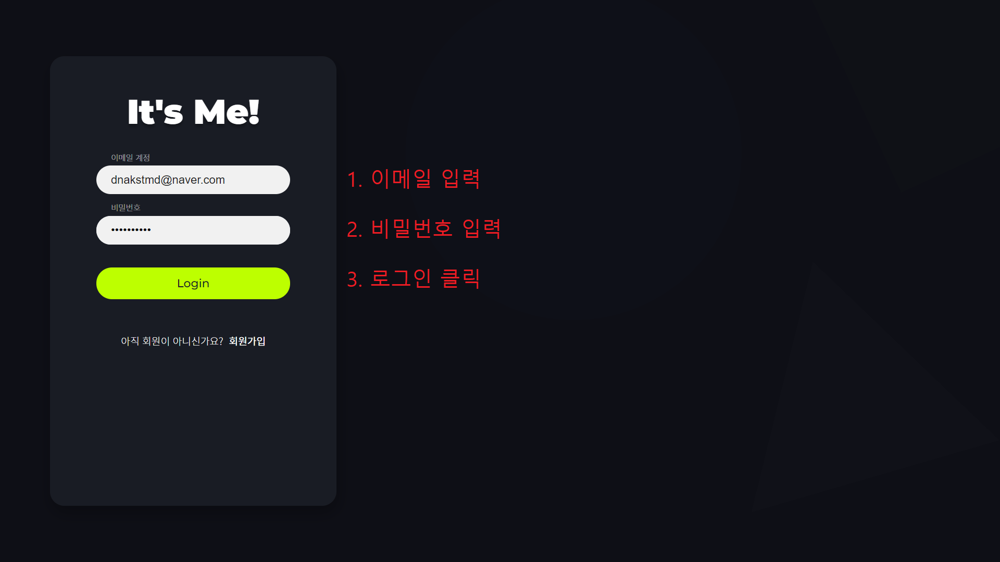

1. 실무자 회원가입 > 아이디는 이메일을 사용하고, 중복확인 후 회원가입 완료
2. 실무자 로그인 > 가입승인이 완료되어 회원가입이 완료된 계정은 자체 로그인 가능 
3. 관리자 로그인 > 관리자 페이지에서 가입승인 가능

## 3. partners 링크 생성

### 1. partners 메인 페이지

### 2. 신규 링크 생성 - 관리자, 만료일시 설정

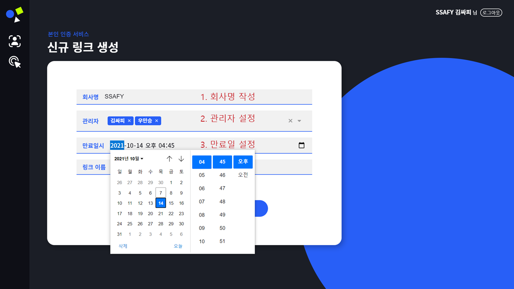

### 3. 신규 링크 생성 - 링크 이름 설정 및 고객 데이터 등록

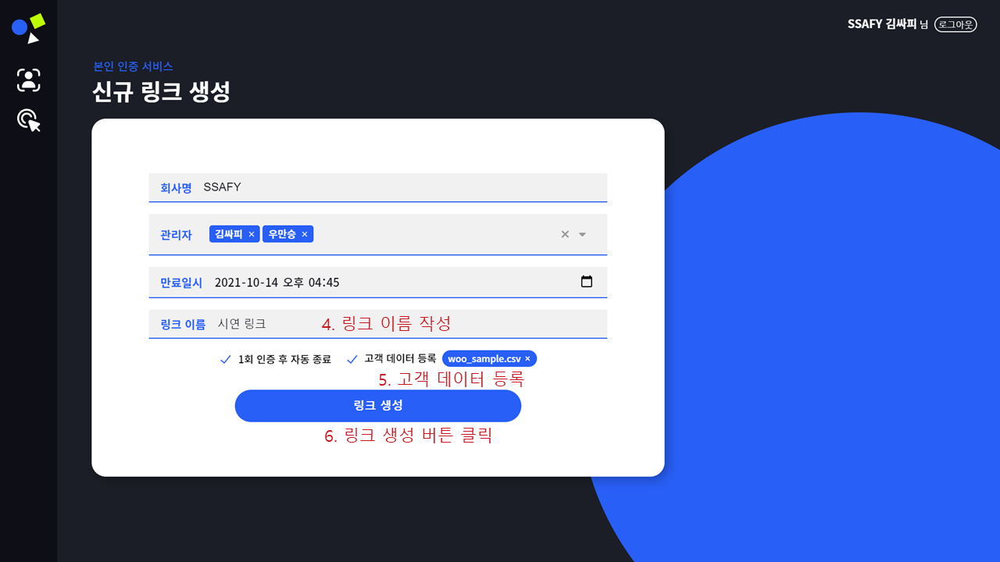

### 4. 신규 링크 생성 - 링크 생성 완료 및 링크 복사

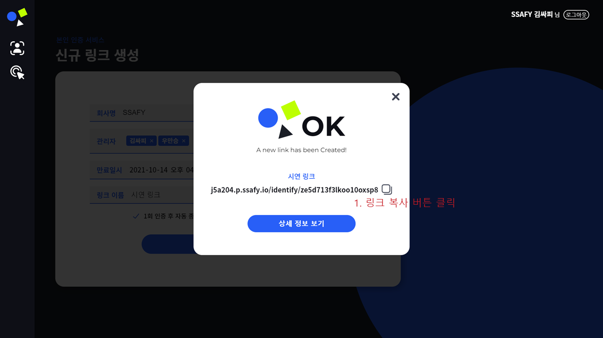

1. 메인 페이지에서 링크 생성 페이지와 링크 관리 페이지로 이동이 가능
2. 링크 생성 시 회사명, 링크 관리자, 만료일시, 링크 이름, 고객 데이터를 입력
3. 링크 생성 버튼을 누르면 링크가 생성되고 링크를 복사한 뒤 고객들에게 링크는 전달

## 4. customers 본인 인증

### 1. 본인 인증 시작

### 2. 카메라 사용 허용

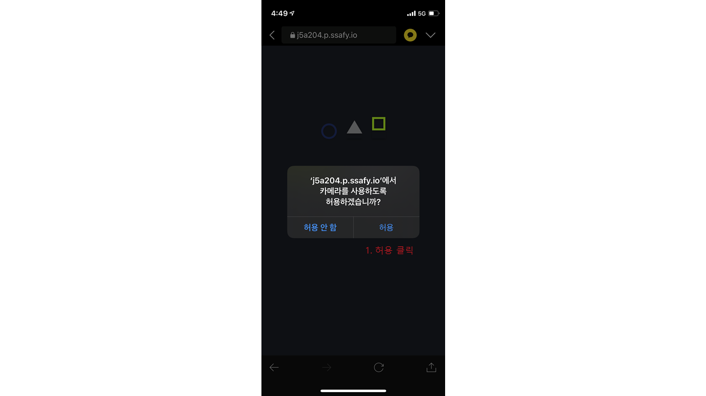

### 3. 얼굴인식을 위한 촬영

### 4. 실물확인을 위한 모션인식

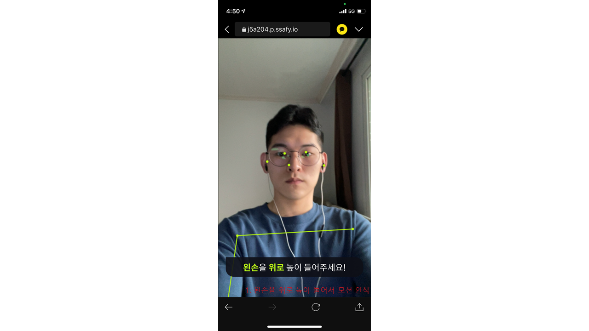

### 5. 주민등록증 촬영

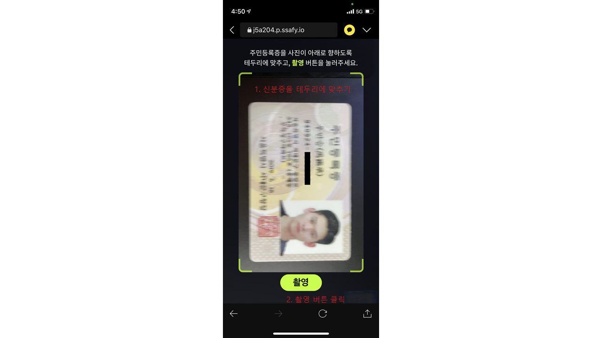

### 6-1. 본인 인증 실패

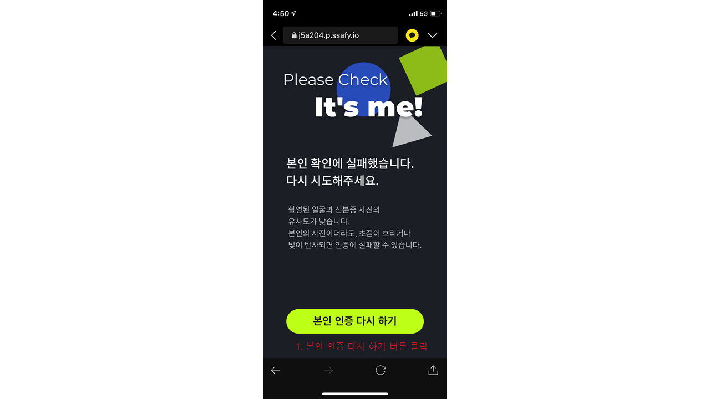

### 6-2. 본인 인증 성공

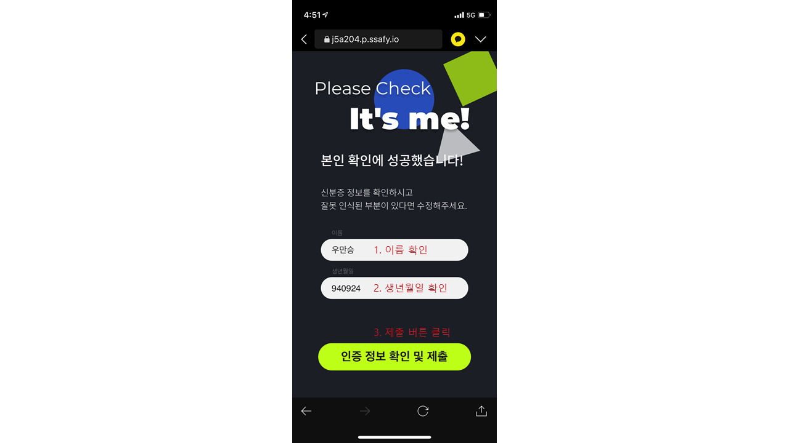

### 7. 본인 인증 완료

## 5. partners 고객정보 관리

### 1. 생성된 링크 목록

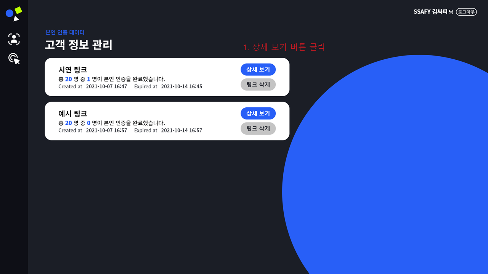

1. 메인페이지에서 고객 정보 관리 페이지로 이동

2. 유저가 관리하고 있는 링크의 목록을 조회

3. 만료일이 지난 링크는 조회되지 않습니다.

### 2. 링크 상세 정보

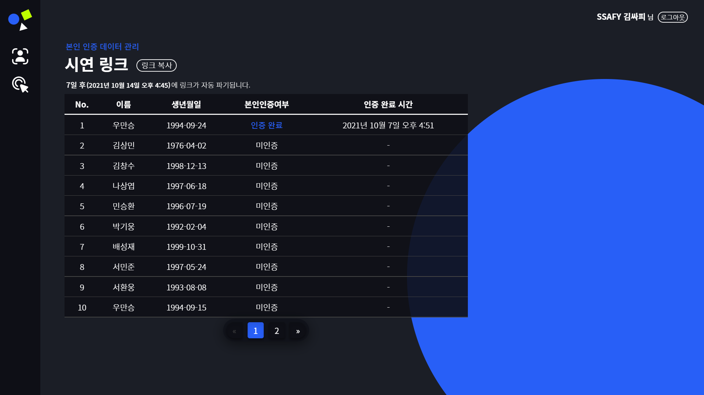

