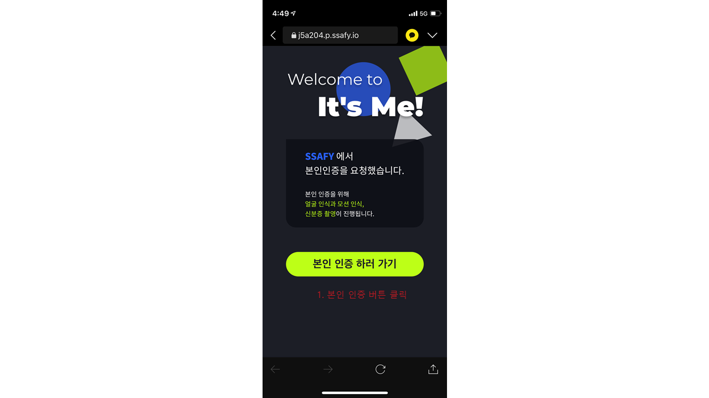
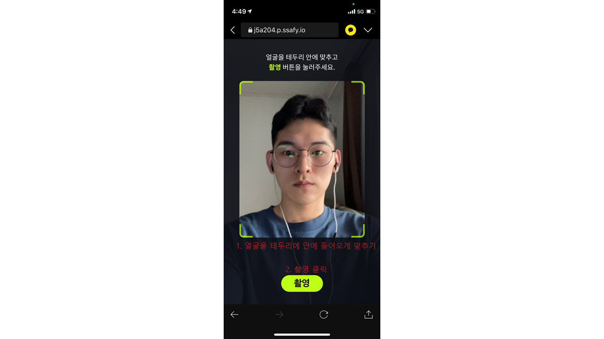

# 시연 시나리오

## 1. B2B Home

### 1. 최초 페이지

## 2. partners 회원가입

### 1. 회원가입 - 소속회사 확인

### 2. 회원가입 - 본인정보 입력

### 3. 회원가입 - 가입대기

### 4. 회원가입 - 가입승인, 관리자 페이지

.png)

### 5. 로그인

1. 실무자 회원가입 > 아이디는 이메일을 사용하고, 중복확인 후 회원가입 완료
2. 실무자 로그인 > 가입승인이 완료되어 회원가입이 완료된 계정은 자체 로그인 가능 
3. 관리자 로그인 > 관리자 페이지에서 가입승인 가능

## 3. partners 링크생성

## 4. customers 본인인증

### 1. 본인 인증 시작

### 2. 카메라 사용 허용

### 3. 얼굴인식을 위한 촬영

### 4. 실물확인을 위한 모션인식

### 5. 주민등록증 촬영

### 6-1. 본인 인증 실패

### 6-2. 본인 인증 성공

1. 이름, 생년월일이 잘못 인식 되었으면 수정 후 제출

### 7. 본인 인증 완료

## 5. partners 고객정보 관리

### 1. 생성된 링크 목록

1. 유저가 관리하고 있는 링크의 목록을 조회

2. 만료일이 지난 링크는 조회되지 않습니다.

### 2. 링크 상세 정보

